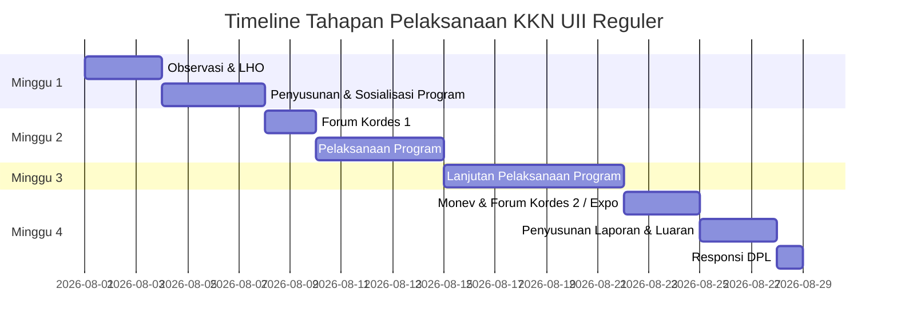

# 📋 PERBEKALAN KKN UII REGULER ANGKATAN 73
> **Panduan Ringkas & Tata Tertib Administrasi KKN**

---

## 📌 RINGKASAN & DETAIL DAFTAR NAMA GAMBAR / FILE ACUAN

Berikut adalah daftar lengkap **nama file acuan gambar/lampiran** yang disebutkan dalam dokumen pembekalan ini beserta deskripsi peruntukannya:

| No | Nama Gambar / File Tag | Deskripsi Dokumen / Peruntukan | Subbab / Bagian |
|:--:|---|---|---|
| **1** | `kartuidentitaskkn` | Format Kartu Identitas KKN Mahasiswa | Dokumen Utama |
| **2** | `cover` | Format Sampul (Cover) Laporan Program KKN | Bab 4 Lampiran |
| **3** | `halamanpengesahan` | Format Lembar Pengesahan Laporan KKN | Bab 4 Lampiran |
| **4** | `suratselesaiunit` | Format Surat Keterangan Selesai Tugas Unit | Bab 4 Lampiran |
| **5** | `potensiwilayah1` | Format Profil Potensi Wilayah (Buku 30x30 cm - Halaman 1) | Bab 4 Lampiran |
| **6** | `potensiwilayah2` | Format Profil Potensi Wilayah (Buku 30x30 cm - Halaman 2) | Bab 4 Lampiran |
| **7** | `potensiwilayah3` | Format Profil Potensi Wilayah (Buku 30x30 cm - Halaman 3) | Bab 4 Lampiran |
| **8** | `pengesahanpotensiwilayah` | Format Lembar Pengesahan Profil Potensi Wilayah | Bab 4 Lampiran |
| **9** | `serahterimapotensikedesa` | Format Bukti Serah Terima Profil Potensi Wilayah untuk Desa/Kelurahan | Bab 4 Lampiran |
| **10** | `serahterimapotensikekecamatan` | Format Bukti Serah Terima Profil Potensi Wilayah untuk Kecamatan | Bab 4 Lampiran |
| **11** | `sampulcatatankegiatanharian` | Sampul / Cover Buku Catatan Kegiatan Harian Mahasiswa | Form Individu |
| **12** | `isicatatankegiatanharian` | Form Isian Harian & Paraf Masyarakat (Buku Catatan Harian) | Form Individu |
| **13** | `daftarhadirharian` | Form Presensi Hadir Mahasiswa di Posko | Form Posko |
| **14** | `suratizinmeninggalkanlokasi` | Form Surat Izin Meninggalkan Lokasi KKN | Form Posko |
| **15** | `formatamplopdankop` | Format Sablon Amplop Resmi & Kertas Kop Surat Unit | Physical Kit Posko |
| **16** | `formatplangdanstempel` | Format Design Papan Nama Posko (Plang) & Stempel Unit | Physical Kit Posko |
| **17** | `matriksprogramunit` | Format Matriks Program Unit KKN | Form Posko / Unit |
| **18** | `matriksprogramindividu` | Format Matriks Program Individu KKN | Form Individu |
| **19** | `jadwalaktivitasdanbimbingan` | Format Jadwal Aktivitas & Pembimbingan Mahasiswa | Form Individu |
| **20** | `daftarhadirpeserta` | Form Presensi Hadir Peserta/Masyarakat Kegiatan KKN | Form Kegiatan |

---

## 📇 DOKUMEN UTAMA MAHASISWA

* **Kartu Identitas KKN (Masing-masing)**
*(File Acuan: `kartuidentitaskkn`)*
  * **Wajib**: Menempelkan Pas Foto dan Tanda Tangan.
  * **Kewajiban**: Harus selalu dibawa selama seluruh kegiatan KKN berlangsung.
* **Buku Pedoman KKN (Masing-masing)**
  * Menjadi panduan operasional teknis dan administratif selama periode KKN.

---

## 📘 BAB 2: PELAKSANAAN KKN

### 1. Organisasi Mahasiswa KKN Model Reguler
* **Forum Kordes (Koordinasi Desa)**:
  * Diselenggarakan **minimal 2 kali** dengan mengundang DPL, Pemerintah Desa/Kelurahan, Dukuh, Ketua RT/RW, Perwakilan Tokoh Masyarakat, dan perwakilan dari masing-masing Unit.
  * **Forum Kordes 1 (Minggu ke-2)**: Penyampaian rencana program KKN dari masing-masing Unit.
  * **Forum Kordes 2 (Minggu ke-3 / ke-4)**: Penyampaian progress/perkembangan proker (dapat digabung dalam bentuk **EKSPO LUARAN KKN** jika program telah selesai).

---

### 2. Ketentuan & Beban Jam Program KKN

| Jenis Program | Penanggung Jawab / Skala | Alokasi Min. Jam | Luaran (Output) Utama |
|---|---|:---:|---|
| **Program Pokok Individu** | Individu (sesuai disiplin ilmu) | **37 Jam** | Laporan kegiatan pengabdian masyarakat individu |
| **Program Pokok Unit** | Unit (skala min. RT, min. 1 dakwah & 1 pemberdayaan) | **38 Jam** | Laporan kegiatan pengabdian unit |
| **Program Pokok Desa** | Kesepakatan Lintas Unit | **25 Jam** | Masterplan, video, profil potensi desa, desain teknis, prototype produk unggulan (*Roadmap Utama*) |
| **Program Bantu Teman** | Lintas Mahasiswa | **25 Jam** | Partisipasi membantu program rekan sejawat |
| **Program Bantu Masyarakat**| Lintas Masyarakat | **25 Jam** | Partisipasi aktif kegiatan kemasyarakatan |

> [!NOTE]
> **Total Perhitungan Volume Jam:**
> * **Total Program Pokok (Individu + Unit + Desa):** Minimal **100 Jam**
> * **Total Program Bantu (Teman + Masyarakat):** Minimal **50 Jam**

#### Ketentuan Perhitungan Jam Kegiatan:
1. **Kegiatan Persiapan**: Observasi, Penyusunan Program, dan Sosialisasi Rencana Program (Individu maks. 2 jam, Unit maks. 2 jam, Desa maks. 3 jam).
   > [!WARNING]
   > Kegiatan non-teknis (persiapan tempat, belanja bahan, pembuatan/distribusi undangan, fotokopi, dll.) **TIDAK DIHITUNG** ke dalam durasi jam KKN.
2. **Kegiatan Pelaksanaan**: Pelaksanaan kegiatan pokok, Laporan Forum Kordes (maks. 3 jam), dan Penyusunan Laporan (maks. 3 jam).

---

### 3. Tahapan Pelaksanaan Mingguan

* **Minggu 1: Observasi & Perencanaan**
  * Komunikasi awal, pengumpulan data (pengamatan, wawancara, kuesioner, data desa).
  * Pengisian **LHO (Laporan Hasil Observasi)** dan kelengkapan administrasi.
  * Klasifikasi & analisis data, penentuan prioritas, dan penyusunan Rencana Kerja Tindak Lanjut.
  * Sosialisasi Rencana Kegiatan Unit kepada masyarakat (kesepakatan waktu, tempat, tahapan, dan anggaran).
* **Minggu 2: Forum Kordes 1 & Start Pelaksanaan**
  * Pelaksanaan Forum Kordes 1 (penyampaian rencana program desa).
  * Eksekusi pelaksanaan kegiatan bersama masyarakat.
* **Minggu 3: Intensifikasi Pelaksanaan**
  * Pelaksanaan lanjutan seluruh program pokok dan bantu bersama masyarakat.
* **Minggu 4: Evaluasi, Luaran & Responsi**
  * Pemantauan & Evaluasi (Forum Kordes 2 / Expo Luaran KKN).
  * Menyusun Laporan (Individu, Unit, Desa) & penyelesaian Luaran.
  * Responsi bersama DPL di kampus.

---

### 4. Rincian Metode & Hasil Akhir (Laporan & Luaran)

#### A. Metode Observasi & Pokok Diskusi
* **Metode**: Pengamatan langsung, studi data sekunder, kuesioner, dan wawancara.
* **Sumber Data**: Pejabat pemerintah desa, tokoh informal, masyarakat sasaran, kondisi lingkungan, data pemerintah desa.
* **Pokok Diskusi Hasil Observasi**:
  1. Rumusan masalah, tujuan, dan solusi pemecahan.
  2. Target / parameter ketercapaian tujuan.
  3. Metode dan strategi pencapaian tujuan.
  4. Nama Program Kegiatan.
  5. Rencana Waktu Pelaksanaan.
  6. Materi pendukung (bahan, alat, narasumber, dll.).
  7. Rencana pembiayaan.

#### B. Mekanisme Pelaporan
* Mahasiswa menyusun laporan sesuai format pengabdian masyarakat.
* Verifikasi dan pengesahan oleh DPL.
* Laporan diunggah ke Google Drive (akses link dibuka/publik).
* Link diserahkan ke DPPM UII untuk verifikasi.
* **Tenggat**: Paling lambat **2 minggu** setelah penarikan KKN.

#### C. Jenis-Jenis Luaran KKN
1. **Buku Profil / Master Plan / Dokumen Rancangan Teknis**: Dicetak dalam bentuk **buku dengan ukuran 30 x 30 cm** $\rightarrow$ Validasi DPL $\rightarrow$ Diserahkan ke Kepala Desa. (Softfile diunggah ke GDrive & DPPM).
2. **Produk / Prototype**: Dilengkapi dokumentasi, spesifikasi teknik, dan lembar pengesahan.
3. **Video Profil / Master Plan / Dokumen Rancangan Teknis**.
4. **Naskah Publikasi Pengabdian**: Disubmit ke Jurnal **JAMALI** atau jurnal pengabdian lainnya. DPL memilih minimal 1 judul per unit dan DPL bertindak sebagai *corresponding author*.

#### D. Responsi
* Mengukur pemahaman, penguasaan lapangan, capaian program, dan evaluasi mahasiswa oleh DPL.
* Pelaksanaan berlokasi di lingkungan kampus UII.

---

## 📕 BAB 3: TATA TERTIB & KEWAJIBAN ADMINISTRASI

> [!IMPORTANT]
> **Checklist Kewajiban Administrasi Posko:**
> * [ ] Menandatangani / paraf **Daftar Hadir Harian**.
> * [ ] Mengisi **Laporan Hasil Observasi (LHO)** hingga Rencana Kerja Tindak Lanjut dan disahkan DPL.
> * [ ] Membuat **Surat Izin Meninggalkan Lokasi** (ditandatangani tokoh masyarakat & dilaporkan DPL) jika meninggalkan posko.
> * [ ] **Menempelkan** Daftar Hadir Harian dan Matriks Program/Kegiatan di papan pengumuman Posko.
> * [ ] **Meninggalkan Buku Catatan Kegiatan Harian di Posko** (kecuali saat keluar berkegiatan).
> * [ ] Mencatat seluruh kegiatan KKN di Buku Catatan Kegiatan Harian & **meminta paraf masyarakat sasaran secara langsung**.
> * [ ] Kegiatan yang melibatkan pihak luar (instansi/lembaga) wajib dituangkan dalam proposal, diketahui & disahkan DPL, Kepala Dukuh, dan Kepala Desa.
> * [ ] Menyerahkan tanda bukti penyerahan dana bantuan posko ke DPL $\rightarrow$ Pusat KKN DPPM UII.
> * [ ] Menggunakan seluruh dana bantuan posko secara transparan sesuai peruntukannya.

---

## 📙 BAB 4: LAMPIRAN & FORMAT DOKUMEN

### 1. Format Laporan Program KKN
* **Ketentuan Penulisan**: Font Times New Roman, 12 pt, 1.5 spasi, kertas A4 Portrait.
* **Alur Struktur Laporan**:
  $$\text{COVER} \rightarrow \text{HALAMAN PENGESAHAN} \rightarrow \text{INTISARI} \rightarrow \text{IDENTITAS UNIT} \rightarrow \text{DESKRIPSI PROGRAM} \rightarrow \text{PELAKSANAAN PROGRAM}$$
  * **Identitas Unit**: Nama, foto, NIM, prodi/fakultas, nama program.
  * **Pelaksanaan Program**: Uraian proses pelaksanaan (persiapan, pelaksanaan, evaluasi) + foto kegiatan/dokumen pendukung.

### 2. Format Referensi File / Gambar Lampiran
* **Format Cover Laporan**: *(File: `cover`)*
* **Format Halaman Pengesahan Laporan**: *(File: `halamanpengesahan`)*
* **Format Surat Keterangan Selesai Unit**: *(File: `suratselesaiunit`)*
* **Format Profil Potensi Wilayah**: *(File: `potensiwilayah1`, `potensiwilayah2`, `potensiwilayah3`)*
  * **Spesifikasi**: Dibuat dan dicetak dalam bentuk **buku dengan ukuran 30 x 30 cm**.
* **Format Pengesahan Profil Potensi Wilayah**: *(File: `pengesahanpotensiwilayah`)*
* **Format Serah Terima Profil Potensi Desa**: *(File: `serahterimapotensikedesa`)*
* **Format Serah Terima Profil Potensi Kecamatan**: *(File: `serahterimapotensikekecamatan`)*

---

## 📒 PETUNJUK PENGISIAN FORMULIR & IDENTITAS FISIK UNIT

### 1. Buku Catatan Kegiatan Harian (Individu)
*(File Acuan: `sampulcatatankegiatanharian`)*
*(File Acuan: `isicatatankegiatanharian`)*
* **Aturan Pengisian**:
  * Isi identitas cover secara lengkap dan benar.
  * Wajib dibawa saat berkegiatan KKN. Jika tidak berkegiatan, tinggalkan di posko.
  * **Wajib menggunakan pulpen**. Apabila ada kesalahan, **hanya boleh dicoret** (DILARANG menggunakan cairan penghapus / Tipp-Ex).
  * > [!CAUTION]
    > **DILARANG KERAS MEMALSUKAN DATA DAN TANDA TANGAN.**
* **Struktur Kolom**:
  * **Kolom 1**: Nomor Urut Kegiatan.
  * **Kolom 2**: Hari, Tanggal, & Jam Kegiatan.
  * **Kolom 3**: Nama Kegiatan.
  * **Kolom 4**: Lokasi Tempat Kegiatan.
  * **Kolom 5–8**: Sumber Dana & Rincian Nominal (`Rp X.XXX,-`):
    * *Kolom 5*: Mahasiswa / DPPM UII.
    * *Kolom 6*: Masyarakat.
    * *Kolom 7*: Pemerintah Daerah (Pemda).
    * *Kolom 8*: Lembaga / Kelompok Mitra saat pengajuan proposal.
  * **Kolom 9**: TTD Tokoh Masyarakat (Camat, Kades, Lurah, atau Tokoh Masyarakat).
  * **Kolom 10**: TTD DPL / DPPM UII.
  * *Catatan*: Baris bagian atas untuk **Kegiatan Pokok**, sedangkan bagian bawah untuk **Kegiatan Bantu**.

---

### 2. Presensi Hadir Mahasiswa di Lokasi
*(File Acuan: `daftarhadirharian`)*
* **Status**: **WAJIB DITEMPEL** di Papan Pengumuman Posko.
* **Header Form**: Nomor Unit, Dusun, Desa/Kelurahan, Kecamatan, Kabupaten/Kota.
* **Struktur Tabel**:
  * **Kolom 1**: Nama Mahasiswa.
  * **Kolom 2**: NIM.
  * **Kolom 3**: Kategori (S & M).
  * **Kolom Tanggal**: Setiap tanggal memiliki 2 sub-kolom:
    1. Jam Piket (Pagi / Malam).
    2. TTD / Paraf Mahasiswa yang bersangkutan (**TIDAK BOLEH DIWAKILKAN**).
  * **Kolom Akhir**: Keterangan.
* **Pengesahan**: TTD & Nama Terang Kades/Kadus, Dosen Pembimbing Field (DPL), dan Ketua Unit.

---

### 3. Surat Izin Meninggalkan Lokasi
*(File Acuan: `suratizinmeninggalkanlokasi`)*
* **Fungsi**: Izin resmi saat mahasiswa ingin meninggalkan lokasi KKN.
* **Mekanisme**: Dibuat 2 rangkap (1 ditinggalkan di Posko, 1 dibawa oleh mahasiswa yang berizin).
* **Komponen Isian**: Identitas Mahasiswa, Identitas Unit & Lokasi KKN, Tujuan Izin, Waktu Keberangkatan (Hari/Tgl/Jam), Waktu Rencana Kembali (Hari/Tgl/Jam), TTD Mengetahui Tokoh Masyarakat, TTD Mahasiswa Pemohon.

---

### 4. Aturan Kelengkapan Physical Kit Posko & Dokumen Official
*(File Acuan: `formatamplopdankop`)*
*(File Acuan: `formatplangdanstempel`)*

* **Logo Resmi UII**:
  * Berwarna (Background Biru, Tulisan UII Putih, Tulisan Arab & Bingkai Warna Kuning).
* **Amplop Resmi**:
  * **Ukuran**: $110\text{ mm} \times 230\text{ mm}$.
  * **Fungsi**: Mengirim dokumen resmi (surat, proposal, laporan) kepada pihak luar (pemerintah desa, sekolah, puskesmas, instansi).
* **Kertas Kop Surat**:
  * **Spesifikasi**: Kertas HVS Folio 70 gram.
  * **Batas Kop**: $15\text{ mm}$ dari tepi atas (Kop Atas) & $15\text{ mm}$ dari tepi bawah (Kop Bawah).
  * **Fungsi**: Media penulisan surat resmi Unit KKN agar memiliki identitas & legalitas resmi UII.
* **Papan Nama Unit (Plang Posko)**:
  * **Format Tulisan**: `POSKO UNIT [Kode Wilayah]-[Nomor Unit]`
  * **Desain**: Dasar Biru, Tulisan Putih.
  * **Kode Wilayah Kabupaten/Kota**:
    * `SL` : Kab. Sleman | `BT` : Kab. Bantul | `GK` : Kab. Gunung Kidul | `KP` : Kab. Kulon Progo
    * `YK` : Kota Yogyakarta | `KL` : Kab. Klaten | `BY` : Kab. Boyolali | `MG` : Kab. Magelang | `PW` : Kab. Purworejo
  * **Fungsi**: Penanda fisik resmi lokasi Posko KKN UII bagi masyarakat dan pihak kampus.
* **Cap / Stempel Unit**:
  * **Bentuk & Warna**: Oval dengan tinta warna Biru / Ungu.
  * **Fungsi**: Tanda pengesahan administrasi pada dokumen resmi yang diterbitkan Unit KKN.

---

### 5. Matriks Program Unit & Individu
*(File Acuan: `matriksprogramunit`)*
*(File Acuan: `matriksprogramindividu`)*

* **Status**: **WAJIB DITEMPEL** di Papan Pengumuman Posko.
* **Header Form**: Dusun/RW/Instansi, Kecamatan, Desa/Kelurahan, Kabupaten/Kota, Individu/Kelompok, Model Reguler.
* **Pengisian Kolom Tabel**:
  * **Kolom 1 (Bidang)**: Bidang / Tema kegiatan.
  * **Kolom 2 (Macam Kegiatan)**: Nama kegiatan / program.
  * **Kolom 3 (Timeline R/P)**: 
    * 🟥 **Arsir Merah**: Perencanaan / Observasi.
    * 🟦 **Arsir Biru**: Realisasi / Pelaksanaan.
    * *(Coret yang tidak perlu)*.
  * **Kolom 5 (Jumlah Jam)**: Total durasi pelaksanaan kegiatan.
  * **Kolom 6 (Penanggung Jawab)**: Nama mahasiswa penanggung jawab.
  * **Kolom 7 (Lokasi)**: Tempat pelaksanaan kegiatan.
  * **Kolom 8 (Ket. Waktu)**: Jam mulai – Jam selesai (misal: `08.00 - 10.00`).

---

### 6. Jadwal Aktivitas dan Pembimbingan
* **Fungsi**: Panduan timeline seluruh kegiatan KKN dan bimbingan DPL.
* **Format File Acuan**: *(File: `jadwalaktivitasdanbimbingan`)*

---

### 7. Presensi Peserta Kegiatan
*(File Acuan: `daftarhadirpeserta`)*
* **Fungsi Dokumen**: Daftar hadir peserta/masyarakat sebagai bukti sah administrasi bahwa program kerja KKN benar-benar dilaksanakan dan diikuti peserta. Menjadi lampiran penting laporan kegiatan & evaluasi DPL.
  > [!NOTE]
  > Form ini **bukan** untuk absensi harian mahasiswa KKN, melainkan mencatat kehadiran warga/peserta acara.
* **Kapan Digunakan**: Setiap kali unit menyelenggarakan kegiatan yang melibatkan peserta masyarakat (Sosialisasi, Penyuluhan, Pelatihan UMKM, Pendampingan Sertifikasi Halal, dll.).
* **Petunjuk Pengisian**:
  * Nama Kegiatan & Nama Pembawa Materi.
  * Hari, Tanggal, Tahun, Waktu & Tempat Pelaksanaan.
  * Identitas KKN: Angkatan KKN 73, Semester (6/7), Tahun Akademik (2025/2026 atau 2026/2027), Model KKN Reguler.
  * Isian Tabel Peserta: Nama Peserta, Alamat Tinggal, dan Tanda Tangan Peserta.
  * Pengesahan: Tanda tangan Pemateri / Tokoh Masyarakat & Tanda tangan Mahasiswa Penanggung Jawab Kegiatan.
